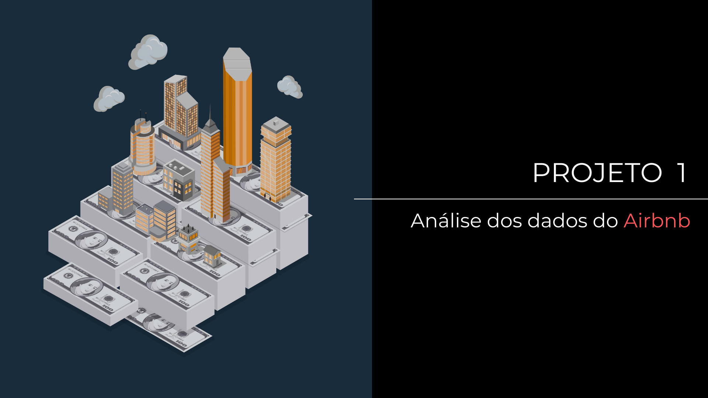

  

# Data Science

Este repositório é dedicado ao compartilhamento de projetos na área de *Data Science*, sendo atualizado com projetos desenvolvidos ao longo do meu aprendizado.

Meu objetivo com o estudo nesta área é desenvolver habilidades analíticas, combinar pensamento crítico e atenção aos detalhes para ampliar a capacidade no desenvolvimento de projetos e resolução de problemas na área acadêmica e profissional.

**Trilha de aprendizado:** Python, Manipulação e Visualização de Dados, Machine Learning, Deed Learning.

## 🚀 Projetos

<a href="projetos/projeto_01/" title="Análise dos dados do Airbnb">
<strong>Análise dos dados do Airbnb</strong>
</a>

<strong>Projeto 01</strong> | <strong>Atualizado: Mar 2026</strong>

 
Neste projeto, é utilizado um conjunto de dados da plataforma Airbnb disponível publicamente para a cidade de Nova York, com o objetivo de aplicar técnicas de manipulação e visualização de dados.

  

---

